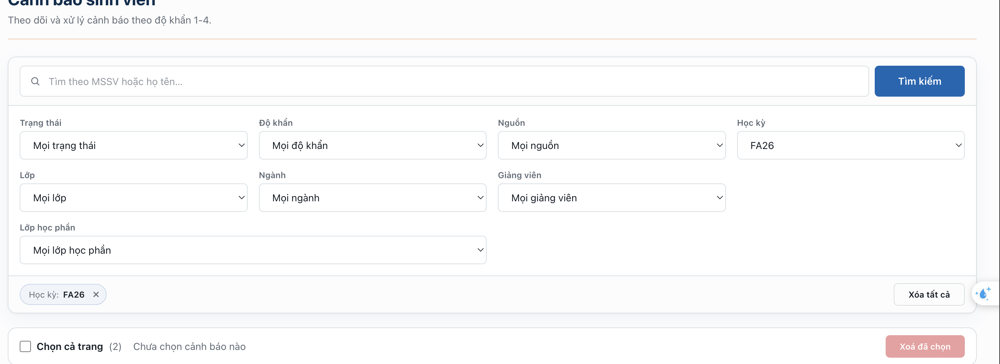

## Kế Hoạch Xử Lý Logic Hệ Thống Cảnh Báo (Tạm Thời)

**Vấn đề:** Hệ thống hiện tại hiển thị quá nhiều cảnh báo cùng lúc, gây ra tình trạng quá tải thông tin (ngợp).

### 1. Quy tắc xử lý (Đã chốt)

- **Điều kiện:** Khi mức độ cảnh báo được thiết lập bởi Giảng viên **thấp hơn** mức cảnh báo của Hệ thống tự động.
- **Hành động:**
  - Tự động **nâng mức cảnh báo** của Giảng viên lên tương đương với hệ thống.
  - Thực hiện **phát lại (replay)** cảnh báo sau khi đã nâng cấp độ.
  - _Lưu ý:_ Nếu cảnh báo đang mở thì không cần tạo thêm cảnh báo mới, chỉ cần cập nhật (update) mức cảnh báo của cảnh báo hiện tại đó.

### 2. Sắp xếp (Sort)

- Cho phép sắp xếp (sort) danh sách cảnh báo theo **độ khẩn**.
  

### 3. Bộ lọc (Filter)

- **Giao diện mặc định:** Dành khoảng trống tối đa để hiển thị bảng (table) danh sách.
- **Thao tác:** Chỉ hiển thị bộ lọc (show filter) khi người dùng nhấn vào một button (nút) chức năng tương ứng.

### 4. Điều kiện hiển thị độ khẩn

- Hệ thống CTS chỉ hiển thị và thực hiện thông báo đối với các cảnh báo từ **mức cảnh báo 3 trở lên**.

### 5. Quy định màu sắc và mức độ cảnh báo

| Mức độ    | Ý nghĩa / Trạng thái    | Màu sắc đặc trưng       | Mô tả chi tiết                                                                                                                             |
| :-------- | :---------------------- | :---------------------- | :----------------------------------------------------------------------------------------------------------------------------------------- |
| **Mức 1** | Bình thường / Thấp      | 🔵 Xanh dương / Xanh lá | Hệ thống hoạt động ổn định, không có rủi ro hoặc rủi ro ở mức tối thiểu, an toàn để tiếp tục vận hành.                                     |
| **Mức 2** | Cảnh báo / Trung bình   | 🟡 Vàng                 | Phát hiện dấu hiệu bất thường nhỏ hoặc rủi ro tiềm ẩn. Cần theo dõi, giám sát chặt chẽ nhưng chưa cần can thiệp khẩn cấp.                  |
| **Mức 3** | Nguy hiểm / Cao         | 🟠 Cam                  | Sự cố hoặc rủi ro lớn đã xảy ra, có nguy cơ gây gián đoạn hoặc thiệt hại đáng kể. Cần triển khai ngay các biện pháp ứng phó.               |
| **Mức 4** | Nghiêm trọng / Khẩn cấp | 🔴 Đỏ                   | Tình trạng cực kỳ nguy hiểm, thảm họa hoặc gián đoạn toàn bộ hệ thống. Yêu cầu kích hoạt ngay lập tức đội ứng phó khẩn cấp ở mức cao nhất. |

### 6. Cấu hình Môi trường (Environment Variables)

- Thêm một biến mới trong file `.env`.
- **Mục đích:** Khi bật (enable) biến này lên, hệ thống sẽ tự động chặn/ngăn việc gửi Email và Push Notification.
